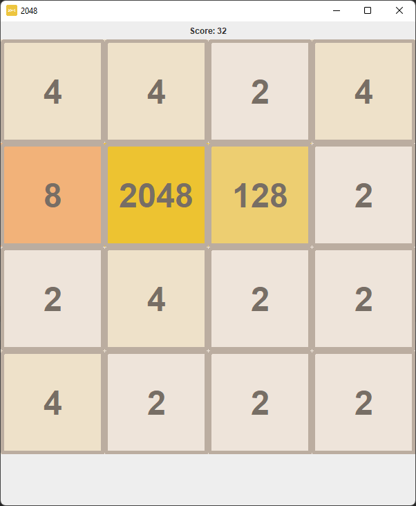

# 2048
My Recreation of the awesome game [**_2048_**](https://github.com/gabrielecirulli/2048)

- Uses the Java **GUI**

## Download
- Option \#1:
  * Download the [**`.jar`**](release/2048.jar)
  * Download the [**Java 19 JDK**](https://www.oracle.com/java/technologies/downloads/#jdk19-windows) to open the application
  
- Option \#2:
  * Download [**_Intellij Idea_**](https://www.jetbrains.com/idea/)
  * Clone this Repository
  * Run the Application in the Idea

## Screenshot

